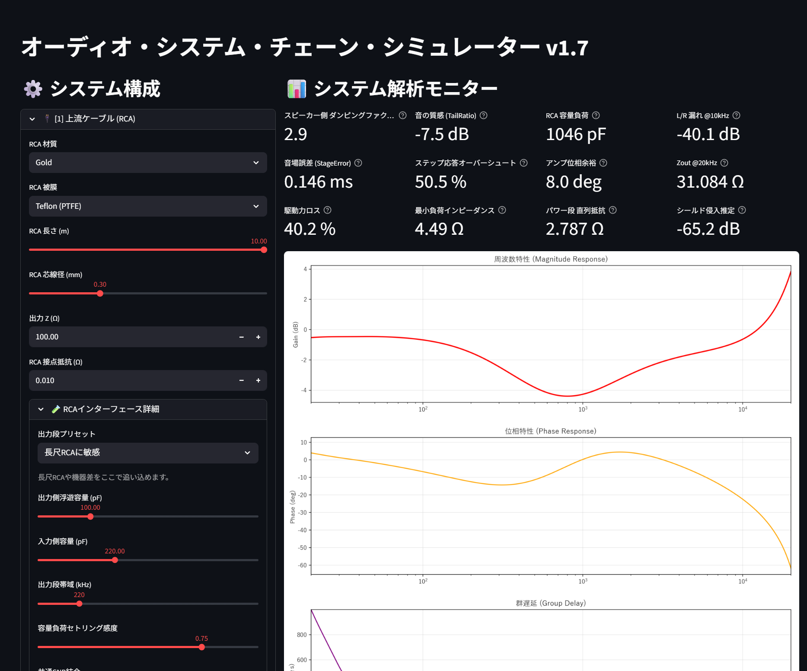

# Audio Cable & System Chain Simulator

[English README](./README.md) | [アーキテクチャ](./ARCHITECTURE.md)



ケーブルの物理特性、機器との相互作用、アンプの挙動、時間領域の崩れを
まとめて扱う、研究中のオーディオ・シミュレータです。

このリポジトリは、「すべてのケーブル論争に決着をつけた」という立場では
ありません。現時点での位置づけは、もう少し実務的です。

- ケーブル物理、インターフェース負荷、アンプ、DSP、聴感指標を一つの流れで扱える
- 長尺や劣化したケーブル条件では、システム挙動が実際に悪化しうることを数値で追える
- 今後の実測・検証を進めるための研究基盤として使える

## 研究ステータス

このプロジェクトは今のところ、

- シミュレータ
- 仮説生成ツール
- 進化中の研究プロトタイプ

として見るのがいちばん近いです。

聴感のすべてを説明し切った最終理論、という位置づけではありません。

## モデル化しているもの

- 導体・構造・被膜を含む RLGC ベースのケーブル挙動
- RCA ライン段の相互作用
  - 出力インピーダンス
  - ケーブル容量
  - セトリング
  - 共通リターン汚染
  - シールド品質
  - 接点劣化
- 小信号アンプの安定性
  - ループ余裕
  - 極移動
  - 位相余裕
  - 周波数依存 `Zout`
- 非線形アンプ挙動
  - スルーレート制限
  - 電源サグ
  - 高調波
- スピーカー側の複雑負荷と長尺ケーブルの制動低下
- 誘電吸収、熱変調、インパルス応答、ステップ応答などの時間領域効果

## 現在の主題

特に次の2つを重点的に追っています。

1. なぜ安物や長尺の RCA が、単純な RC ローパス以上に「籠る」ように感じられるのか
2. なぜ非常に長いスピーカーケーブルは、単に音量が下がるだけでなく
   「力がない」「制動が甘い」と感じられるのか

現状のモデルでも、条件を厳しくするとこの2つの傾向はある程度出せます。

## アプリで見られる指標

- 振幅特性 / 位相特性
- 群遅延
- インパルス応答
- ステップ応答
- TailRatio
- StageError
- RCA 容量負荷
- L/R 漏れ推定
- シールド侵入推定
- 駆動力ロス
- 最小負荷インピーダンス
- ダンピングファクター
- 位相余裕推定
- `Zout @ 20 kHz`

## ファイル構成

- `app.py`
  リポジトリ直下に残した薄い起動入口
- `src/audiofilter/app.py`
  Streamlit UI
- `src/audiofilter/system_chain.py`
  解析と試聴で共通の信号チェーン構築
- `src/audiofilter/cable_model.py`
  RLGC モデルと材質/被膜パラメータ
- `src/audiofilter/interface_model.py`
  RCA 相互作用、セトリング、共通リターン、シールド/接点劣化
- `src/audiofilter/speaker_load_model.py`
  複雑スピーカー負荷モデル
- `src/audiofilter/amplifier_small_signal.py`
  小信号アンプ安定性モデル
- `src/audiofilter/amplifier_model.py`
  非線形アンプモデル
- `src/audiofilter/audio_processor.py`
  FIR 生成と時間領域エミュレーション
- `src/audiofilter/analysis_metrics.py`
  TailRatio、StageError、ステップ応答指標

## インストール

```bash
pip install -r requirements.txt
```

## 実行

```bash
streamlit run app.py
```

## 公開ドキュメント

- [English README](./README.md)
- [アーキテクチャ](./ARCHITECTURE.md)
- [論文ドラフト](./paper/README.md)

より細かい作業メモは `private/` にありますが、公開向けの主文書ではありません。

## 現時点の限界

- スピーカー負荷はまだ実測ではなく合成モデル
- 真のランダム RF 侵入、ハム、断続的な接点不良はまだ不十分
- IEM / ヘッドホン系はスピーカー系より簡略化されている
- 実測アンプのボード線図はまだ直接読み込んでいない
- 聴感との対応づけは、まだ本格的な統制聴取実験までは進んでいない

## 今後

- 実測インピーダンスの読み込み
- 安物/長尺 RCA のノイズ侵入モデル強化
- より物理寄りのスピーカー運動モデル
- 実測アンプ応答の取り込み
- ベンチ測定との突き合わせ強化

## ライセンス

このリポジトリは Apache License 2.0 を使用します。詳しくは [LICENSE](./LICENSE) を見てにゃ。
